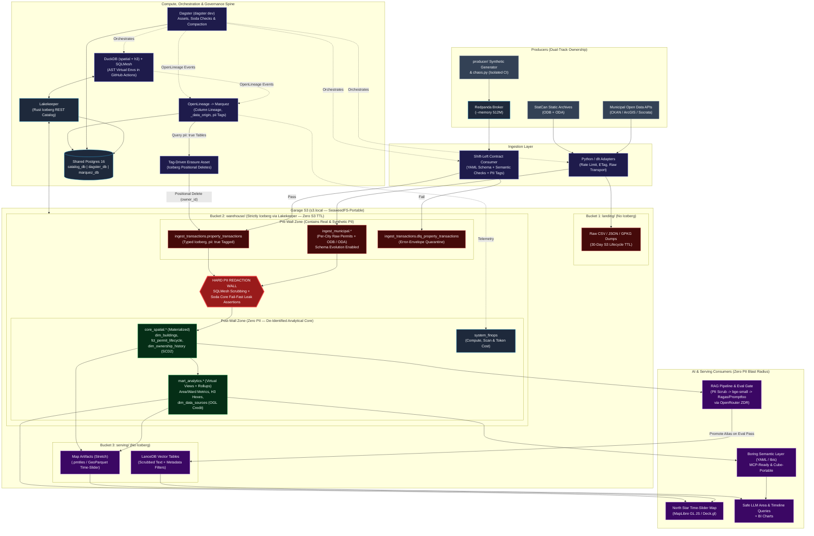
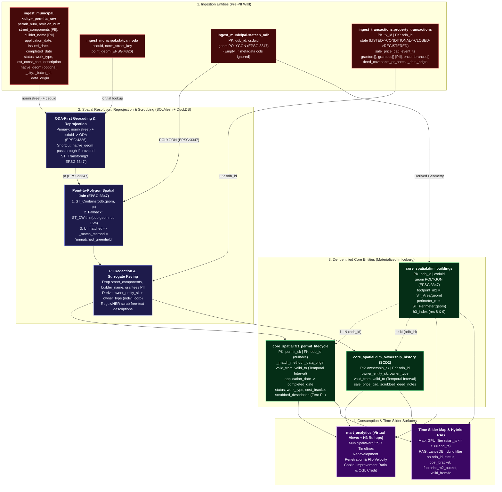

# Architecture Diagrams

## System & Boundary Map

```mermaid
flowchart TB
    %% Styling (high contrast for GitHub Light & Dark modes)
    classDef prod fill:#334155,stroke:#94a3b8,color:#f8fafc
    classDef pii fill:#450a0a,stroke:#f87171,color:#fef2f2
    classDef wall fill:#991b1b,stroke:#ef4444,stroke-width:3px,color:#ffffff
    classDef clean fill:#052e16,stroke:#4ade80,color:#f0fdf4
    classDef infra fill:#1e293b,stroke:#38bdf8,color:#f8fafc
    classDef ctrl fill:#1e1b4b,stroke:#818cf8,color:#eef2ff
    classDef serve fill:#3b0764,stroke:#c084fc,color:#faf5ff

    subgraph PRODUCERS["Producers (Dual-Track Ownership)"]
        direction LR
        MUN["Municipal Open Data APIs<br/>(CKAN / ArcGIS / Socrata)"]:::prod
        STAT["StatCan Static Archives<br/>(ODB + ODA)"]:::prod
        PROD["producer/ Synthetic Generator<br/>& chaos.py (Isolated CI)"]:::prod
        RP["Redpanda Broker<br/>(--memory 512M)"]:::infra
        PROD --> RP
    end

    subgraph INGEST["Ingestion Layer"]
        direction LR
        DLT["Python / dlt Adapters<br/>(Rate Limit, ETag, Raw Transport)"]:::ctrl
        GATE["Shift-Left Contract Consumer<br/>(YAML Schema + Semantic Checks + PII Tags)"]:::ctrl
    end

    MUN & STAT --> DLT
    RP --> GATE

    subgraph GARAGE["Garage S3 (s3.local — SeaweedFS-Portable)"]
        direction TB

        subgraph LANDING["Bucket 1: landing/ (No Iceberg)"]
            RAW_FILES["Raw CSV / JSON / GPKG Dumps<br/>(30-Day S3 Lifecycle TTL)"]:::pii
        end

        subgraph WAREHOUSE["Bucket 2: warehouse/ (Strictly Iceberg via Lakekeeper — Zero S3 TTL)"]
            direction TB
            subgraph PRE_WALL["Pre-Wall Zone (Contains Real & Synthetic PII)"]
                direction LR
                ING_MUN["ingest_municipal.*<br/>(Per-City Raw Permits + ODB / ODA)<br/>Schema Evolution Enabled"]:::pii
                ING_TX["ingest_transactions.property_transactions<br/>(Typed Iceberg, pii: true Tagged)"]:::pii
                DLQ["ingest_transactions.dlq_property_transactions<br/>(Error-Envelope Quarantine)"]:::pii
            end

            PII_WALL{{"HARD PII REDACTION WALL<br/>SQLMesh Scrubbing + Soda Core Fail-Fast Leak Assertions"}}:::wall

            subgraph POST_WALL["Post-Wall Zone (Zero PII — De-Identified Analytical Core)"]
                direction LR
                CORE["core_spatial.* (Materialized)<br/>dim_buildings, fct_permit_lifecycle,<br/>dim_ownership_history (SCD2)"]:::clean
                MART["mart_analytics.* (Virtual Views + Rollups)<br/>Area/Ward Metrics, H3 Hexes,<br/>dim_data_sources (OGL Credit)"]:::clean
                FINOPS["system_finops<br/>(Compute, Scan & Token Cost)"]:::infra
            end

            ING_MUN & ING_TX --> PII_WALL
            PII_WALL --> CORE
            CORE --> MART
        end

        subgraph SERVING_B["Bucket 3: serving/ (No Iceberg)"]
            direction LR
            LANCE["LanceDB Vector Tables<br/>(Scrubbed Text + Metadata Filters)"]:::serve
            TILES["Map Artifacts (Stretch)<br/>(.pmtiles / GeoParquet Time-Slider)"]:::serve
        end
    end

    DLT --> RAW_FILES
    DLT --> ING_MUN
    GATE -- "Pass" --> ING_TX
    GATE -- "Fail" --> DLQ

    subgraph COMPUTE_SPINE["Compute, Orchestration & Governance Spine"]
        direction LR
        SQLM["DuckDB (spatial + h3) + SQLMesh<br/>(AST Virtual Envs in GitHub Actions)"]:::ctrl
        DAG["Dagster (dagster dev)<br/>Assets, Soda Checks & Compaction"]:::ctrl
        MARQ["OpenLineage -> Marquez<br/>(Column Lineage, _data_origin, pii Tags)"]:::ctrl
        ERASE["Tag-Driven Erasure Asset<br/>(Iceberg Positional Deletes)"]:::ctrl
        PG[("Shared Postgres 16<br/>catalog_db | dagster_db | marquez_db")]:::infra
        LAKE["Lakekeeper<br/>(Rust Iceberg REST Catalog)"]:::infra
    end

    SQLM <--> LAKE
    LAKE <--> WAREHOUSE
    LAKE & DAG & MARQ --> PG
    DAG -. "Orchestrates" .-> DLT & GATE & SQLM
    SQLM & DAG -. "OpenLineage Events" .-> MARQ
    MARQ -. "Telemetry" .-> FINOPS
    MARQ -- "Query pii: true Tables" --> ERASE
    ERASE -- "Positional Delete (owner_id)" --> ING_TX

    subgraph CONSUMERS["AI & Serving Consumers (Zero PII Blast Radius)"]
        direction LR
        RAG["RAG Pipeline & Eval Gate<br/>(PII Scrub -> bge-small -> Ragas/Promptfoo<br/>via OpenRouter ZDR)"]:::serve
        BSL["Boring Semantic Layer (YAML / Ibis)<br/>MCP-Ready & Cube-Portable"]:::serve
        MAP["North Star Time-Slider Map<br/>(MapLibre GL JS / Deck.gl)"]:::serve
        LLM["Safe LLM Area & Timeline Queries<br/>+ BI Charts"]:::serve
    end

    CORE --> RAG
    RAG -- "Promote Alias on Eval Pass" --> LANCE
    MART --> BSL --> LLM
    LANCE --> LLM
    MART & CORE --> TILES --> MAP
    MART --> MAP
```

## Spatial & Temporal Entity Sketch

```mermaid
flowchart TB
    classDef raw fill:#450a0a,stroke:#f87171,color:#fef2f2
    classDef hop fill:#1e1b4b,stroke:#818cf8,color:#eef2ff
    classDef core fill:#052e16,stroke:#4ade80,color:#f0fdf4
    classDef out fill:#3b0764,stroke:#c084fc,color:#faf5ff

    subgraph RAW_ENT["1. Ingestion Entities (Pre-PII Wall)"]
        direction LR
        P_RAW["<b>ingest_municipal.&lt;city&gt;_permits_raw</b><br/>permit_num, revision_num<br/>street_components [PII], builder_name [PII]<br/>application_date, issued_date, completed_date<br/>status, work_type, est_const_cost, description<br/>native_geom (optional)<br/>_city, _batch_id, _data_origin"]:::raw

        ODA["<b>ingest_municipal.statcan_oda</b><br/>csduid, norm_street_key<br/>point_geom (EPSG:4326)"]:::raw

        ODB["<b>ingest_municipal.statcan_odb</b><br/>PK: odb_id, csduid<br/>geom POLYGON (EPSG:3347)<br/>(Empty '..' metadata cols ignored)"]:::raw

        TX_RAW["<b>ingest_transactions.property_transactions</b><br/>PK: tx_id | FK: odb_id<br/>state (LISTED->CONDITIONAL->CLOSED->REGISTERED)<br/>sale_price_cad, event_ts<br/>grantors[], grantees[] [PII], encumbrances[]<br/>deed_covenants_or_notes, _data_origin"]:::raw
    end

    subgraph HOPS["2. Spatial Resolution, Reprojection & Scrubbing (SQLMesh + DuckDB)"]
        direction LR
        GEO["<b>ODA-First Geocoding & Reprojection</b><br/>Primary: norm(street) + csduid -> ODA (EPSG:4326)<br/>Shortcut: native_geom passthrough if provided<br/>ST_Transform(pt, 'EPSG:3347')"]:::hop

        SJOIN["<b>Point-to-Polygon Spatial Join (EPSG:3347)</b><br/>1. ST_Contains(odb.geom, pt)<br/>2. Fallback: ST_DWithin(odb.geom, pt, 15m)<br/>3. Unmatched -> _match_method = 'unmatched_greenfield'"]:::hop

        SCRUB["<b>PII Redaction & Surrogate Keying</b><br/>Drop street_components, builder_name, grantees PII<br/>Derive owner_entity_sk + owner_type (indiv | corp)<br/>Regex/NER scrub free-text descriptions"]:::hop
    end

    P_RAW -- "norm(street) + csduid" --> GEO
    ODA -- "lon/lat lookup" --> GEO
    GEO -- "pt (EPSG:3347)" --> SJOIN
    ODB -- "POLYGON (EPSG:3347)" --> SJOIN
    SJOIN --> SCRUB
    TX_RAW -- "FK: odb_id" --> SCRUB

    subgraph CORE_ENT["3. De-Identified Core Entities (Materialized in Iceberg)"]
        direction LR
        DIM_B["<b>core_spatial.dim_buildings</b><br/>PK: odb_id | csduid<br/>geom POLYGON (EPSG:3347)<br/>footprint_m2 = ST_Area(geom)<br/>perimeter_m = ST_Perimeter(geom)<br/>h3_index (res 8 & 9)"]:::core

        FCT_P["<b>core_spatial.fct_permit_lifecycle</b><br/>PK: permit_sk | FK: odb_id (nullable)<br/>_match_method, _data_origin<br/>valid_from, valid_to (Temporal Interval)<br/>application_date -> completed_date<br/>status, work_type, cost_bracket<br/>scrubbed_description (Zero PII)"]:::core

        DIM_O["<b>core_spatial.dim_ownership_history (SCD2)</b><br/>PK: ownership_sk | FK: odb_id<br/>owner_entity_sk, owner_type<br/>valid_from, valid_to (Temporal Interval)<br/>sale_price_cad, scrubbed_deed_notes"]:::core
    end

    ODB -- "Derived Geometry" --> DIM_B
    SCRUB --> FCT_P
    SCRUB --> DIM_O
    DIM_B -. "1 : N (odb_id)" .-> FCT_P
    DIM_B -. "1 : N (odb_id)" .-> DIM_O

    subgraph SERVING_ENT["4. Consumption & Time-Slider Surfaces"]
        direction LR
        MARTS["<b>mart_analytics (Virtual Views + H3 Rollups)</b><br/>Municipal/Ward/CSD Timelines<br/>Redevelopment Penetration & Flip Velocity<br/>Capital Improvement Ratio & OGL Credit"]:::out

        MAP_RAG["<b>Time-Slider Map & Hybrid RAG</b><br/>Map: GPU filter (start_ts <= t <= end_ts)<br/>RAG: LanceDB hybrid filter on odb_id, status,<br/>cost_bracket, footprint_m2_bucket, valid_from/to"]:::out
    end

    DIM_B & FCT_P & DIM_O --> MARTS
    DIM_B & FCT_P & DIM_O --> MAP_RAG
```